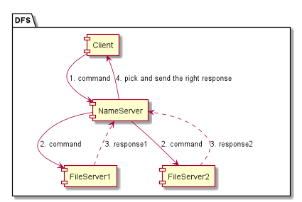
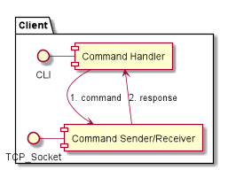
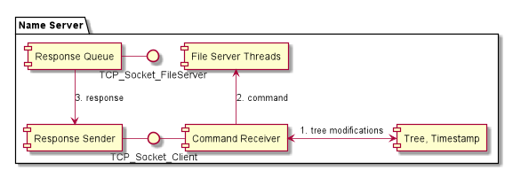
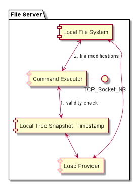

# DS Project 2
Distributed File System implementation.

## Client
Serves as an interface to access the DFS through NameServer.

When run, Client application requires the IP address of the NameServer as an argument.

## FileServer
Represents a storage (possible, remote) server. May be replicated.
Each file server exposes 2 ports: 
1) Port to serve the file requests
2) Backup port to serve as a loading source for other file servers

When run, FileServer application requires the following arguments:
1) Main port
2) Backup port
3) (optional) Address of the file server to load this server from. Format: IP:port

## NameServer
Maintains the file/directory tree and works as a mediator between the client and storage servers.

When run, NameServer application requires to specify addresses of the file servers in the format IP:port

## Architecture
### High-level
  
The general flow is this:
1) Client constructs a command and sends it to the NameServer.
2) NameServer analyzes the command and propagates it to FileServers. 
3) Each connected FileServers executes a command and provides a response.
4) NameServer picks a consistent response and propagates it to the Client.

### Client
  
Client:
1) Reads commands from the console.
2) Constructs and sends them via socket to the NameServer.
3) Receives and prints responses.

### NameServer
  
When NameServer receives a command via socket, it:
1) Updates the file tree hierarchy.
2) Propagates the command to FileServers.
3) Awaits a response from the FileServer if necessary and sends it to the Client via socket.

### FileServer
  
When FileServer receives a command via socket, it:
1) Checks that it is in consistent state.
2) Reads from/writes to the local file system and sends a response to the NameServer via socket.  

## Docker support
All the components of the application can be found on DockerHub:
- [Client](https://hub.docker.com/repository/docker/deltation/dfs-client)
- [FileServer](https://hub.docker.com/repository/docker/deltation/file-server)
- [NameServer](https://hub.docker.com/repository/docker/deltation/name-server)

## Setting up
Let's assume that we have 2 File Servers and they have the following IP addresses:
- FileServer1: 10.0.15.11
- FileServer2: 10.0.15.12

On FileServer1 host, run:
```
sudo docker pull deltation/file-server
sudo docker run -p 55561:55561 -p 55562:55562 deltation/file-server 55561 55562
```

On FileServer2 host, run:
```
sudo docker pull deltation/file-server
sudo docker run -p 55563:55563 -p 55564:55564 deltation/file-server 55563 55564
```

On NameServer host, run:
```
sudo docker pull deltation/name-server
sudo docker run -p 55556-55560:55556-55560 deltation/name-server 10.0.15.11:55561 10.0.15.12:55563
```

Then, launch the client application and enter the IP of the NameServer host:
```
sudo docker pull deltation/dfs-client
sudo docker run -i -p 55555:55555 deltation/dfs-client <NameServerIP>
``` 

After the client has connected to the NameServer, type `Initialize` to initialize the DFS.

That's it, the DFS is ready to work.

## Replication
Application supports replication of FileServer nodes. If one node is down, others will be able to serve the requests.

If a node that was down is available now, it can rejoin the cluster. Let's assume that the FileServer2 is down. To make it rejoin the cluster, on the FileServer2 host, run:
```
sudo docker run -p 55563:55563 -p 55564:55564 deltation/file-server 55563 55564 10.0.15.11:55562
```
This will cause the FileServer2 to load an up to date state from FileServer1.
